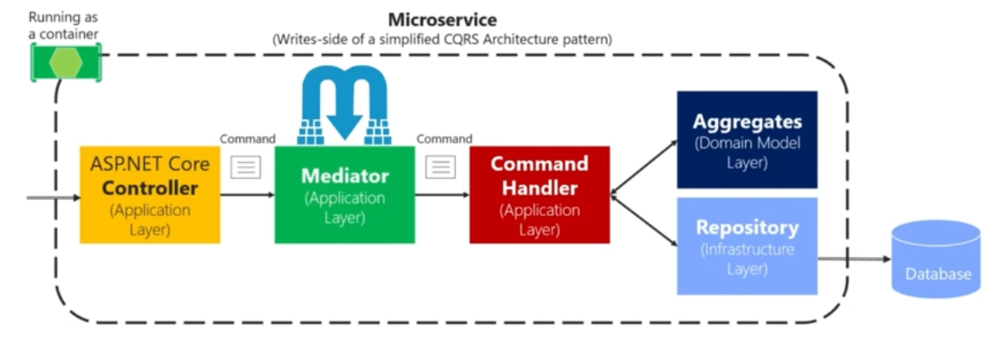
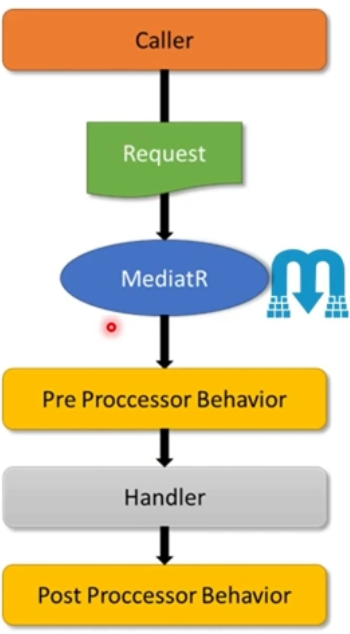

# CQRS - Command Query Responsibility Segregation

## Overview
The **Command Query Responsibility Segregation (CQRS)** pattern is a design approach that separates read and write operations, enhancing performance and scalability, particularly in complex, large-scale systems. By segregating commands (write operations) and queries (read operations), CQRS allows each operation to be optimized independently, avoiding issues like inefficient joins and database locks.

---

## Key Concepts of CQRS

1. **Separates Read and Write Operations**:
   - CQRS divides the application into **Commands** and **Queries**.
   - Each type of operation can use separate databases to enhance performance and scalability.

2. **Commands**:
   - Responsible for write operations that change the state of the application.
   - Typically, commands are isolated to ensure data consistency and avoid complex dependencies.
   - Examples: Adding, updating, or deleting records.

3. **Queries**:
   - Responsible for read operations that retrieve data without altering application state.
   - Can handle complex joins and return data in formats optimized for fast querying.
   - Examples: Fetching data for display or reporting purposes.

4. **Dual Database Strategy**:
   - **Write Database**: Typically uses a relational model to maintain data integrity and ensure consistency.
   - **Read Database**: Often uses a NoSQL or denormalized structure, optimized for fast querying and handling high-volume reads.

---

## Benefits of CQRS

- **Enhanced Performance**: By separating reads and writes, CQRS reduces the load on databases, improving response times and scalability.
- **Avoids Complex Joins**: Write and read databases can be optimized individually, reducing the need for complex join operations.
- **Supports High-Volume Data Requirements**: CQRS is ideal for systems with heavy read loads or complex queries, allowing databases to be fine-tuned for their specific tasks.
- **Reduces Database Locking**: Write and read operations are handled independently, minimizing locking issues during high-concurrency operations.

---

## CQRS with MediatR Library

The **MediatR** library is a popular .NET library that implements the mediator pattern, making it an excellent fit for CQRS. MediatR facilitates the separation of commands and queries by routing requests through a central mediator, thus reducing dependencies and improving maintainability.

### Key Components

- **IRequest Interface**:
  - Defines a request, which can either be a command or a query.
  - The return type of the request is specified as a generic parameter.

- **IRequestHandler<TRequest, TResponse>**:
  - Each handler inherits from this interface, where `TRequest` is the type of the command or query, and `TResponse` is the return type.
  - Commands and queries are processed through their respective handlers, ensuring a clear distinction between read and write operations.

- **Custom Interfaces for Clarity**:
  - To further differentiate between commands and queries, two custom interfaces can be defined:
    ```csharp
    public interface ICommand<TResult> : IRequest<TResult> { }
    public interface IQuery<TResult> : IRequest<TResult> { }
    ```


### MediatR and ASP.NET Core Minimal APIs

**ASP.NET Core** applications using **MediatR** leverage **Minimal APIs** as the entry point for handling HTTP requests. Instead of embedding business logic directly within the API, controllers or endpoints delegate the processing to MediatR, thereby centralizing request handling.

1. **Request Flow**:
   - **Controller**: Receives an HTTP request and creates a command or query object based on the operation (read or write).
   - **MediatR**: Acts as an intermediary, dispatching the command or query object to the appropriate handler.

2. **Handler Execution**:
   - The handler processes the command or query, interacting with:
     - **Aggregates** in the **Domain Model Layer** for domain-specific business rules.
     - **Repositories** in the **Infrastructure Layer** for data persistence.
   - Once processed, the handler returns the result, which MediatR then routes back to the API for a response to the client.

This setup decouples the application logic from the API layer, promoting clean architecture and easier testability. The **Minimal API** framework combined with **MediatR** enhances CQRS by clearly organizing commands and queries, delegating logic to handlers that operate independently of the API layer.


### Mediator Pattern and Pipeline Behaviors

The **Mediator Pattern** is particularly useful in complex or enterprise-level applications, where request processing often involves more than just executing business logic. It provides a centralized approach to managing cross-cutting concerns like logging, validation, auditing, and security checks.

1. **Cross-Cutting Concerns**:
   - Handling a request often requires additional steps beyond the core logic. These steps, known as cross-cutting concerns, are tasks such as logging, validation, auditing, and security checks.

2. **Mediator Pipeline**:
   - MediatR offers a **mediator pipeline** where cross-cutting concerns can be added transparently. This pipeline coordinates the sequence in which these tasks are executed, ensuring consistency in request handling.

3. **Pipeline Behaviors**:
   - In MediatR, **pipeline behaviors** allow the insertion of pre- and post-processing steps around the request handler. 
   - **Pre Processor Behavior**: Executes logic before the main handler.
   - **Post Processor Behavior**: Executes logic after the main handler, allowing actions like logging or auditing to wrap around the core request processing.

4. **Wrapping the Request Handling**:
   - Pipeline behaviors essentially "wrap" around the request handler, enabling developers to implement cross-cutting concerns without embedding them in the handler itself. This approach keeps the core business logic clean and focused while maintaining necessary application-wide functionalities.

5. **LogBehavior**:
   - A behavior that logs details about the handling of each request.
   - Useful for tracking request processing, debugging, and monitoring application performance.

6. **ValidatorBehavior**:
   - A behavior that validates incoming requests before they reach the handler.
   - Ensures that requests meet specified criteria, catching errors early and improving data consistency.

This mediator pipeline setup enables clean, modular code, promoting separation of concerns and enhancing maintainability. Pipeline behaviors make it easy to add or remove functionalities as requirements evolve, especially in larger applications.

---

## CQRS in Large-Scale Microservices

In microservices architectures, particularly for applications with complex or high-volume data needs, CQRS helps manage performance and scalability challenges:

- **Eventual Consistency**: Separate databases for reads and writes may introduce eventual consistency, where the read database reflects the write database after a slight delay.
- **Scalability**: Using dedicated resources for read and write operations allows each to scale independently according to demand.
- **Event Sourcing**: Often combined with CQRS to track every change as an event, ensuring a detailed history of modifications.

---

## Challenges Addressed by CQRS

1. **Inefficient Joins in Monolithic Databases**:
   - Monolithic systems typically use a single database for both CRUD operations and complex joins.
   - As applications grow, handling complex queries in the same database becomes unmanageable and inefficient.

2. **Database Locking**:
   - Performing complex join queries or long-running business logic operations in a single database often locks tables, leading to latency and performance issues.
   - CQRS separates these operations to reduce locking, improving system responsiveness.

3. **Separation of Concerns**:
   - By isolating read and write databases, CQRS allows different database strategies to be applied.
   - **Read Database**: Optimized with denormalized structures, typically in a NoSQL or materialized view.
   - **Write Database**: Retains a normalized, relational structure to ensure data integrity.

---

## CQRS in Action

- **UI Layer**: Routes client requests to either the command or query layer.
- **Command**: Directs write operations to the write database, ensuring data integrity.
- **Query**: Routes read operations to the read database, optimized for fast data retrieval.
- **Eventual Consistency**: Ensures that the read database eventually reflects the latest state of the write database, typically through data replication or materialized views.

---

## Summary

The CQRS pattern offers an effective approach to managing read and write operations separately, enabling applications to handle high-volume data requirements with better performance and scalability. By leveraging CQRS, applications can:
- Avoid database bottlenecks.
- Enhance performance through independent database strategies.
- Scale effectively to meet complex, high-demand scenarios.

In combination with the **MediatR** library, CQRS becomes more manageable and maintainable in .NET applications, ensuring a clear distinction between commands and queries, thereby supporting scalable, flexible, and robust microservices.
