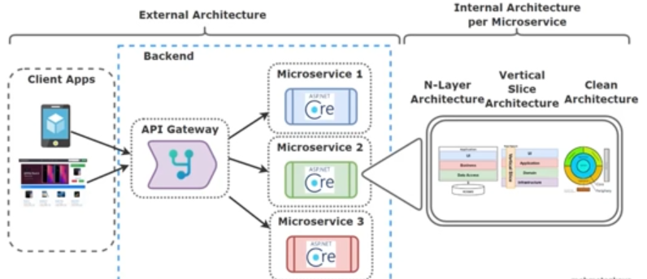

# Developing Catalog.API Cross-Cutting Concerns

## Overview

Developing `Catalog.API` in a microservices architecture requires addressing essential cross-cutting concerns to ensure scalability, reliability, and maintainability. This guide outlines the key strategies and tools used to enhance the `Catalog.API` microservice.

## Key Cross-Cutting Concerns

1. **MediatR Pipeline Behaviours and Fluent Validation Library**
   - Integrate `MediatR` to facilitate a mediator pattern, enabling loose coupling between request handlers and processing logic.
   - Use Fluent Validation for centralized, reusable validation logic, reducing boilerplate code and enhancing maintainability.

2. **Logging and Validation Pipeline Behaviours**
   - Set up centralized logging to capture important application events, aiding in debugging and monitoring.
   - Implement validation in the pipeline to ensure requests are properly validated before reaching business logic.

3. **Global Exception Handling in ASP.NET Core**
   - Implement a global exception handler to standardize error responses and prevent information leakage.
   - This ensures a consistent user experience by providing structured error messages in case of unexpected failures.

4. **Seeding Catalog Database with Marten**
   - Use Marten, a document database library for .NET, to seed the PostgreSQL catalog database.
   - Database seeding is essential in development and testing environments to provide initial data.

5. **Health Checks for Catalog Microservices with PostgreSQL**
   - Implement health checks to monitor the availability and performance of `Catalog.API` and its dependencies, like PostgreSQL.
   - This enables proactive maintenance and faster issue resolution.

6. **Pagination for GetProducts Query**
   - Implement pagination in product retrieval endpoints to handle large datasets efficiently.
   - Pagination improves response times and user experience by delivering data in manageable chunks.

7. **Containerization and Orchestration with Docker and Docker Compose**
   - Use Docker to containerize the `Catalog.API` microservice for consistent deployments across environments.
   - Leverage Docker Compose to orchestrate `Catalog.API` and its dependencies, simplifying setup and teardown.

## Architecture

### External Architecture

- Client applications interact with `Catalog.API` through an API Gateway.
- The API Gateway routes requests to the appropriate microservices within the backend.

### Internal Architecture Per Microservice

- **N-Layer Architecture:** Organizes the code into layers (e.g., Presentation, Application, Domain, and Infrastructure) to separate concerns.
- **Vertical Slice Architecture:** Structures code by feature, promoting modularity and easy feature isolation.
- **Clean Architecture:** Ensures business logic independence, allowing flexibility to replace technologies with minimal impact.

---

This document provides a comprehensive overview of the cross-cutting concerns and architectural strategies used in developing the `Catalog.API` microservice in a cloud-native environment.
