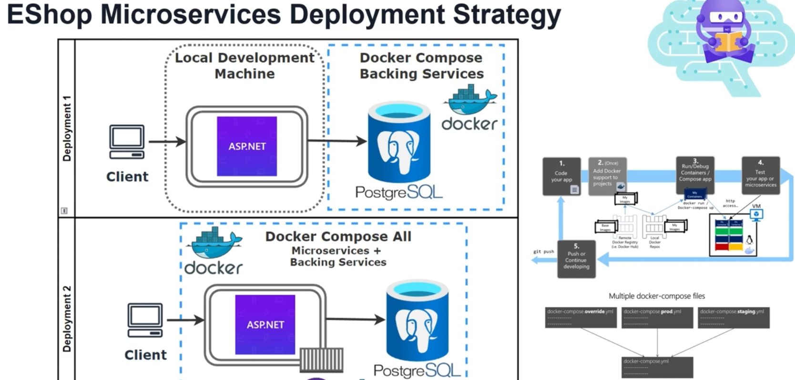

# eShop Microservices Deployment Strategy

This document covers the deployment strategies for eShop microservices using Docker. It includes local development, Docker Compose setups, and the use of Docker Compose files for staging, production, and other environments.

## 1. Overview of Deployment Strategies

eShop's microservices are structured to be deployable in multiple configurations:
- **Deployment 1:** Development environment where the application runs locally, but backing services (e.g., PostgreSQL) run in Docker containers.
- **Deployment 2:** All microservices and backing services run in Docker containers, ideal for staging, testing, and production environments.

Each deployment strategy leverages Docker Compose to manage dependencies, scalability, and service orchestration.

---

## 2. Deployment 1: Local Development with Dockerized Backing Services

In the **Local Development** setup:
- The **ASP.NET application** runs on a local development machine.
- **Backing Services** (e.g., PostgreSQL database) run within Docker containers.
- This setup is optimal for rapid development and debugging on a developer's machine, ensuring fast build times and reducing the need for a full containerized environment.

**Advantages:**
- Faster feedback loops during development.
- Avoids issues that might arise from fully containerized environments, allowing developers to focus on application code.
- Uses Docker only for backing services, reducing resource consumption.

---

## 3. Deployment 2: Docker Compose for Microservices and Backing Services

In **Docker Compose Full Deployment**, all microservices and backing services are deployed in Docker containers:
- The **Client** communicates with the microservices via the containerized network.
- **Docker Compose** manages both microservices and backing services, creating a self-contained environment.

This setup is ideal for staging, production, and large-scale testing, where consistency between environments is essential.

**Advantages:**
- Provides environment parity between local, staging, and production.
- Simplifies deployment to different environments with Docker Compose files.
- Isolates dependencies within containers, reducing conflicts with the host system.

---

## 4. Docker Compose Workflow and Environment-Specific Configurations

### Workflow

1. **Code Your App** - Develop application code for microservices and test locally.
2. **Add Docker Support** - Configure Docker support in each service.
3. **Run Containers** - Use Docker Compose to start containers, enabling inter-service communication.
4. **Test the Application** - Validate functionality within the containerized setup.
5. **Push to Remote Repositories** - Push Docker images to remote registries (e.g., Docker Hub) for staging or production deployment.

### Multiple Docker Compose Files

The deployment strategy can be refined further using multiple Docker Compose files:
- **docker-compose.yml**: The base configuration file, defining services and networks.
- **docker-compose.override.yml**: Overrides settings in `docker-compose.yml`, often used for local development.
- **docker-compose.prod.yml**: Configures settings optimized for production, including environment variables, scaling, and logging.
- **docker-compose.staging.yml**: A staging configuration to mirror production settings while retaining some flexibility for testing.

**Advantages of Multiple Compose Files:**
- Enables configuration for different environments (local, staging, production) without duplicating settings.
- Allows for environment-specific settings like database connection strings, API endpoints, and logging levels.
- Ensures consistency across environments, reducing the chances of "it works on my machine" issues.

---

## 5. Benefits of Docker in Microservices Deployment

Using Docker for eShop microservices deployment offers multiple benefits:
- **Scalability**: Docker makes it easier to scale individual microservices by adjusting the number of replicas in Docker Compose.
- **Consistency**: Environment-specific Docker Compose files ensure that each stage (development, testing, production) has the correct configuration.
- **Portability**: Docker containers can run on any environment that supports Docker, making the deployment agnostic to the underlying infrastructure.
- **Isolation**: Each microservice and backing service runs in its own container, minimizing the risk of dependency conflicts.

---

## Example of Docker Compose Configuration

```yaml
# docker-compose.yml
version: '3.8'

services:
  catalog:
    image: eshop/catalog
    ports:
      - "5001:80"
    environment:
      - ASPNETCORE_ENVIRONMENT=Development
    depends_on:
      - postgres

  postgres:
    image: postgres
    environment:
      POSTGRES_USER: postgres
      POSTGRES_PASSWORD: postgres
      POSTGRES_DB: CatalogDb
    ports:
      - "5432:5432"

# docker-compose.override.yml
# Used for development-specific settings
services:
  catalog:
    environment:
      - ASPNETCORE_ENVIRONMENT=Development
```

---

## Best Practices for Deploying Microservices with Docker

1. **Use a Centralized Logging System** - For production, consider integrating a logging solution (e.g., ELK stack) for better visibility into container logs.
2. **Optimize Docker Images** - Use multi-stage builds to reduce image sizes and improve security by only including necessary dependencies.
3. **Utilize Docker Secrets** - Store sensitive information (e.g., database passwords) using Docker secrets instead of environment variables.
4. **Health Checks** - Define health checks in Docker Compose for each microservice to enable automatic recovery of unhealthy containers.
5. **Networking** - Leverage Docker networks to isolate microservices within a secure environment, preventing unauthorized access from external systems.

---

## Conclusion

The deployment strategy for eShop microservices leverages Docker and Docker Compose for both local development and production-ready setups. With multiple Docker Compose configurations, teams can streamline the development-to-production pipeline, maintain consistency, and improve reliability across environments. Docker's containerization approach enhances microservices' portability, scalability, and isolation, making it ideal for modern cloud-native applications.