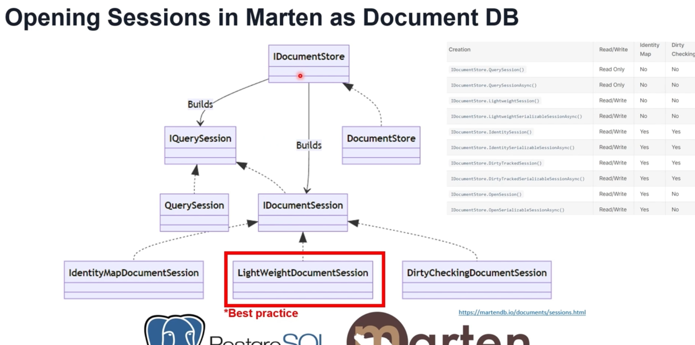

# Opening Sessions in Marten as Document DB
## Overview
Marten, used as a Document Database with PostgreSQL, offers several session types through the `IDocumentStore` interface. These sessions allow different approaches to querying and managing data, depending on application needs for performance, consistency, and change tracking. This guide outlines the primary session types and the recommended best practices for session management in Marten.

## Session Types and Their Use Cases

### 1. **IDocumentStore**
   - `IDocumentStore` is the central component in Marten, responsible for building various types of sessions.
   - It provides multiple methods to create session instances, each with distinct characteristics suited for specific use cases.

### 2. **IQuerySession**
   - Created using `IDocumentStore.QuerySession()` or `IDocumentStore.QuerySessionAsync()`.
   - **Purpose**: Read-only access.
   - **Identity Map**: No.
   - **Dirty Checking**: No.
   - **Use Case**: Efficient data querying when write operations are not required.

### 3. **IDocumentSession**
   - A more flexible session that supports both read and write operations.
   - **Identity Map**: Optional, depending on the session type.
   - **Dirty Checking**: Available on certain types of `IDocumentSession`.
   - **Use Case**: When the application requires both querying and data modification.

## Available Session Types in Marten

| Session Type                              | Creation Method                                       | Read/Write | Identity Map | Dirty Checking |
|-------------------------------------------|-------------------------------------------------------|------------|--------------|----------------|
| **Query Session**                         | `IDocumentStore.QuerySession()`                       | Read Only  | No           | No             |
| **Async Query Session**                   | `IDocumentStore.QuerySessionAsync()`                  | Read Only  | No           | No             |
| **Lightweight Session** *(Best Practice)* | `IDocumentStore.LightweightSession()`                 | Read/Write | No           | No             |
| **Async Lightweight Session**             | `IDocumentStore.LightweightSerializableSessionAsync()`| Read/Write | No           | No             |
| **Identity Session**                      | `IDocumentStore.IdentitySession()`                    | Read/Write | Yes          | Yes            |
| **Async Identity Session**                | `IDocumentStore.IdentitySerializableSessionAsync()`   | Read/Write | Yes          | Yes            |
| **Dirty Tracked Session**                 | `IDocumentStore.DirtyTrackedSession()`                | Read/Write | Yes          | Yes            |
| **Async Dirty Tracked Session**           | `IDocumentStore.DirtyTrackedSerializableSessionAsync()`| Read/Write| Yes          | Yes            |
| **Open Session**                          | `IDocumentStore.OpenSession()`                        | Read/Write | Yes          | No             |
| **Async Open Session**                    | `IDocumentStore.OpenSerializableSessionAsync()`       | Read/Write | Yes          | No             |

## Recommended Session Type

### **LightWeightDocumentSession**
   - **Best Practice**: For most use cases, it is recommended to use `LightWeightDocumentSession`.
   - **Advantages**:
      - Lightweight without identity mapping or dirty checking, making it ideal for performance-sensitive applications.
      - Suitable for stateless operations where changes do not need to be tracked over multiple requests.

## Diagram Overview

- `IDocumentStore` builds various session types (`IQuerySession`, `IDocumentSession`).
- `IQuerySession` and `QuerySession` are primarily for read-only operations.
- `IDocumentSession` encompasses multiple session types, including `LightWeightDocumentSession` (recommended) and `DirtyCheckingDocumentSession` (for scenarios requiring dirty checking).

## Conclusion

Selecting the appropriate session type in Marten depends on the application's data management needs. For high performance without tracking changes, **LightWeightDocumentSession** is recommended as the best practice. For more complex operations requiring identity mapping and dirty checking, sessions like `IdentitySession` and `DirtyTrackedSession` are available.

For more details, refer to the [Marten documentation on sessions](https://martendb.io/documents/sessions.html).
