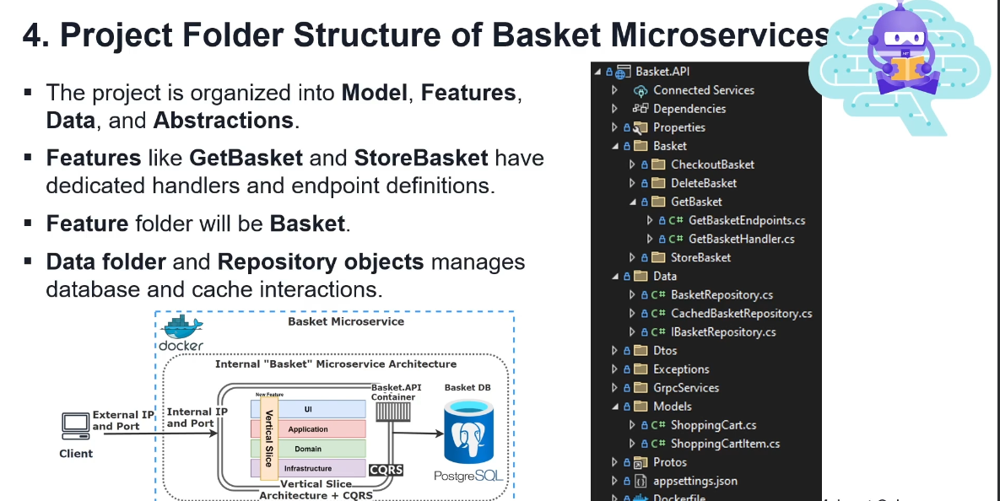

# Project Folder Structure of Basket Microservices

## Overview
The project is organized into several key folders, each serving a specific purpose to maintain a clean and manageable architecture:

- **Model**: Contains data models that represent the core entities within the application.
- **Features**: Houses the different features of the application, including dedicated handlers and endpoint definitions.
- **Data**: Manages data-related operations and repository objects for database interactions.
- **Abstractions**: Contains interfaces that define contracts for services used across the application.

## Key Features
- The **GetBasket** and **StoreBasket** features are examples of operations within the application. Each of these features has its own dedicated handlers and endpoint definitions.
- The feature folder for these operations is named **Basket**.
  
## Data Management
- The **Data** folder contains repository objects that handle interactions with the database and cache. This structure promotes a clean separation of concerns and enhances maintainability.

## Visual Representation
Below is a visual representation of the internal architecture of the Basket microservices:

- **Basket API**: The main API container for managing basket operations.
- **PostgreSQL**: The database used to store basket-related information.