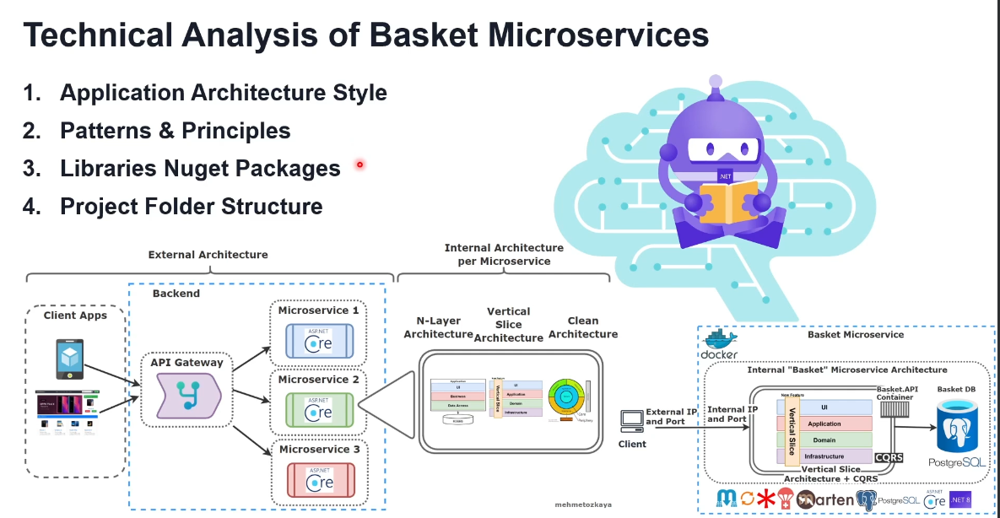

# Technical Analysis of Basket Microservices

## 1. Application Architecture Style
- The application is designed using microservices architecture, enabling modular development and deployment.
- Each microservice can operate independently, allowing for scalability and flexibility.

## 2. Patterns & Principles
- **N-Layer Architecture:** Organizes the application into different layers, promoting separation of concerns.
- **Vertical Slice Architecture:** Each feature is contained in its own folder with relevant classes, facilitating easier maintenance and development.
- **CQRS (Command Query Responsibility Segregation):** Separates read and write operations for better performance and scalability.

## 3. Libraries NuGet Packages
- The application leverages various NuGet packages to enhance functionality and facilitate development.
- Key libraries include:
  - **Marten:** For document database support.
  - **MediatR:** To implement CQRS.
  - **FluentValidation:** For input validation.
  - **Carter:** For minimal API endpoint definition.

## 4. Project Folder Structure
- The project is organized into folders based on features and functionalities, promoting clarity and maintainability.
- Folder structure includes:
  - **Microservices:** Individual service implementations.
  - **Data:** Data models and repositories.
  - **Handlers:** Logic for handling commands and queries.

## Summary
The Basket Microservices architecture employs modern design principles and patterns, which enhance the maintainability and scalability of the application while providing a robust framework for development.