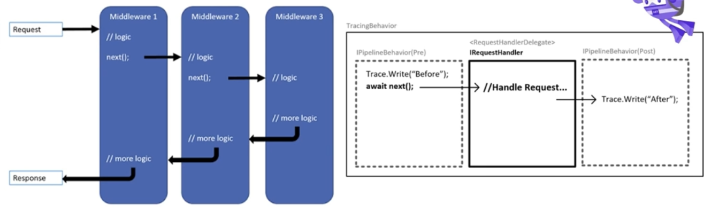

# Middleware Pipeline and Pipeline Behavior in .NET

## Overview

In a .NET application, handling HTTP requests often involves passing the request through multiple layers of middleware and behaviors. This pattern enables separation of concerns, such as logging, authentication, validation, and exception handling. The image illustrates two key concepts:

1. **Middleware Pipeline** - a sequence of middleware components where each middleware can perform actions before and/or after invoking the next component in the chain.
2. **Pipeline Behavior** - in libraries like MediatR, behaviors wrap around handlers to allow actions before and after request handling in a similar, structured way.

## Middleware Pipeline

The middleware pipeline consists of several components, each performing specific tasks on incoming requests and responses. Here’s how it works:

1. **Request Handling in Sequence**:
   - Each middleware component receives the request and performs specific logic.
   - The `next()` function is invoked to pass the request to the next middleware in the pipeline.

2. **Execution Flow**:
   - Middleware 1 starts by executing its initial logic, then calls `next()` to pass the request to Middleware 2.
   - Middleware 2 performs its logic, then invokes `next()` to pass the request to Middleware 3.
   - After reaching the last middleware, responses flow back through each middleware, allowing each one to execute any additional logic before sending the final response.

3. **Use Cases**:
   - Logging: Log requests and responses at each stage.
   - Authentication: Check if the request is authenticated before proceeding.
   - Validation: Validate the request data to ensure it meets required formats or rules.

The Middleware Pipeline pattern is beneficial in web applications for processing HTTP requests and generating consistent responses.

## Pipeline Behavior in MediatR

Pipeline behaviors are part of MediatR's request pipeline, providing a structured way to run code before and after the main request handler:

1. **Structure of Pipeline Behavior**:
   - Each behavior wraps around the request handler.
   - Pre-processing logic is executed before invoking the request handler.
   - Post-processing logic is executed after the request handler completes.

2. **Example of Tracing Behavior**:
   - A behavior can write a trace or log before (`Trace.Write("Before");`) and after (`Trace.Write("After");`) the main request handler.
   - This ensures that specific actions, like tracing, are consistently applied around every request handling process.

3. **Benefits**:
   - Centralized Control: Allows you to define cross-cutting concerns such as logging, validation, and exception handling at a single location.
   - Cleaner Handlers: The main request handlers remain focused on business logic, free from cross-cutting code.

### Sample Code

```csharp
public class TracingBehavior<TRequest, TResponse> : IPipelineBehavior<TRequest, TResponse>
{
    public async Task<TResponse> Handle(
        TRequest request, 
        RequestHandlerDelegate<TResponse> next, 
        CancellationToken cancellationToken)
    {
        Trace.Write("Before");
        var response = await next();
        Trace.Write("After");
        return response;
    }
}
