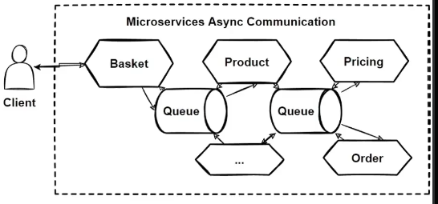

# Microservices Asynchronous Communication

Asynchronous communication in a microservices architecture allows services to interact without requiring the client or producer to wait for a response. This model is typically implemented using messaging protocols and broker systems to handle message delivery asynchronously.

## Key Concepts of Asynchronous Communication

* **Asynchronous Request**: The client sends a request to the service but **does not wait for a response**.
* **Non-Blocking**: The client **does not block a thread** while waiting, allowing it to perform other tasks immediately.
* **AMQP Protocol**: Uses **Advanced Message Queuing Protocol (AMQP)** for handling message exchange in asynchronous systems.
* **Message Brokers**: Clients can send messages through brokers like **Kafka** and **RabbitMQ**, which facilitate communication by adding the message to a queue.
* **No Waiting for Response**: The **message producer** does not wait for a response, allowing the producer to continue other tasks.
* **Subscriber Systems**: Messages are consumed by subscriber systems asynchronously, ensuring **no waiting for a response** by any system.

## Workflow Blueprint for Asynchronous Communication

The following blueprint shows how asynchronous communication flows from a client through various microservices using queues and message brokers.

### Workflow Steps:

1. **Client → Basket Service**: The client sends a request to the **Basket** service but does not wait for a response.
2. **Basket Service → Queue**: The Basket service places the request in a queue rather than calling the next service directly.
3. **Queue → Product Service**: The Product service listens to the queue and processes the request asynchronously.
4. **Product Service → Queue**: If further processing is needed, the Product service places a message in the next queue.
5. **Queue → Pricing Service and Order Service**: The subsequent services (e.g., Pricing and Order) consume messages from the queue as subscribers, processing requests independently.

## Characteristics of Asynchronous Communication

* **Non-Blocking Nature**: Messages are processed without requiring the sender to wait for a response.
* **Improved Scalability**: Services can handle more requests since they are not constrained by synchronous response times.
* **Decoupled Services**: Asynchronous communication allows services to be decoupled, improving resilience and flexibility.

## Use Cases for Asynchronous Communication

* **Event-Driven Architectures**: Ideal for systems where events trigger further actions, such as order processing and notifications.
* **High-Load Environments**: Useful for handling large volumes of requests without blocking resources.
* **Microservices Integration**: Allows loosely coupled services to interact seamlessly without direct dependencies.

## Considerations

Asynchronous communication is efficient and scalable, but it can introduce complexity in handling message order, retries, and error handling. It is essential to implement robust monitoring and retry mechanisms in systems that rely heavily on asynchronous messaging.