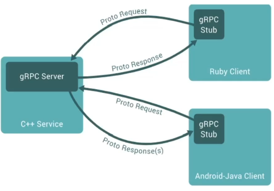
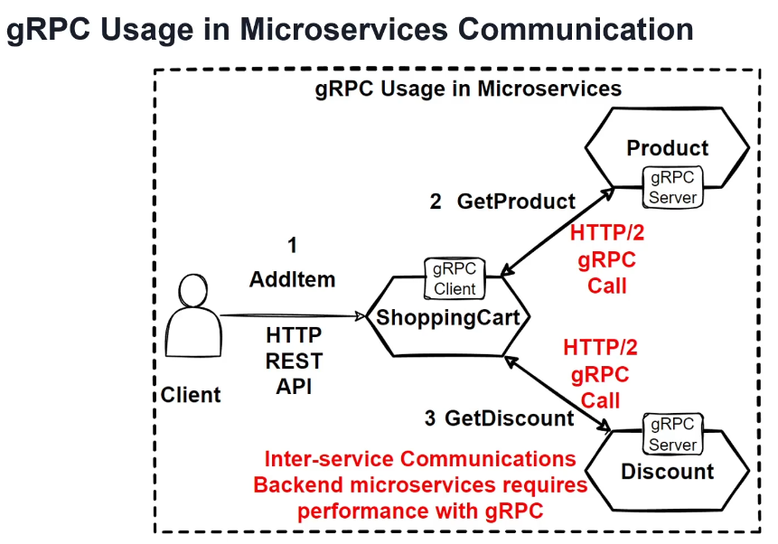

# gRPC: High Performance Remote Procedure Calls

gRPC is an open-source remote procedure call (RPC) system developed at Google. It is designed to efficiently connect services in distributed systems, making it highly suitable for microservices architectures.

## Key Features of gRPC

- **Remote Procedure Calls**: gRPC provides a way for services to call methods on remote services as if they were local, using RPC.
- **High Performance**: It is focused on high performance and uses the **HTTP/2 protocol** to transport binary messages, which allows for faster communication compared to traditional text-based protocols.
- **Protocol Buffers**: gRPC relies on **Protocol Buffers (Protobuf)**, a language-agnostic serialization format, to define service contracts. Protobuf allows defining the interface to be used in service-to-service communication, regardless of the programming language.
- **Cross-Platform**: gRPC generates **cross-platform client and server bindings** for multiple programming languages, enabling seamless integration in polyglot environments.
- **Microservices-Friendly**: gRPC is commonly used in microservices due to its ability to efficiently connect services, making it a popular choice in modern service-oriented architectures.

## Why Use gRPC?

- **Efficient Communication**: gRPC uses binary data transfer, which is more efficient and reduces the data size over the wire, compared to JSON or XML.
- **HTTP/2 Protocol**: By leveraging HTTP/2, gRPC supports features like multiplexing and server push, enhancing performance and reducing latency.
- **Language-Agnostic Interfaces**: The use of Protocol Buffers means that services can communicate seamlessly, irrespective of the language they are written in.
- **Wide Adoption in Microservices**: gRPC is widely used in scenarios where high performance and reliability in service communication are essential, particularly in microservices architectures.

## Additional Advantages of gRPC Framework

- **Language Independence**: The gRPC framework allows developers to create services that can communicate with each other **efficiently** and **independently** in their preferred programming language.
- **Automated Code Generation**: Once you **define a contract** with Protobuf, this contract can be used by each service to automatically **generate the code** that sets up the communication infrastructure.
- **Ideal for Microservices**: This feature simplifies the creation of service interactions and, together with high performance, makes gRPC the **ideal framework** for creating microservices.

## Usage Scenarios

The most common use cases for gRPC include:

1. **Connecting Microservices**: gRPC is often used in microservices environments to handle inter-service communication efficiently.
2. **Real-Time Services**: Applications requiring real-time updates, like chat applications or streaming services, benefit from gRPC's low latency.
3. **Polyglot Architectures**: In environments where services are written in multiple languages, gRPC's cross-platform bindings simplify service integration.

## How gRPC Works

- **Client-Server Communication**: gRPC is a form of client-server communication that uses a **function call** rather than a typical HTTP call.
- **Direct Method Calls**: In gRPC, a client application can directly call a method on a server application on a **different machine** as if it were a local object.
- **Service and Method Definitions**: gRPC is based on defining a **service** and its methods, which can be called remotely with their parameters and return types.
- **Server-Side Implementation**: On the server side, the server implements the interface and runs a gRPC server to handle client calls.
- **Client-Side Stub**: On the client side, the client has a stub that provides the same methods as the server.
- **Environment Flexibility**: gRPC clients and servers can work and communicate with each other in different environments, supporting various programming languages.

### Diagram of gRPC Communication

The following diagram demonstrates how gRPC clients and servers interact. Each client (e.g., Ruby, Android-Java) has a gRPC stub, allowing it to send **Proto Requests** and receive **Proto Responses** from the gRPC server hosting the service (e.g., C++).

## Conclusion

gRPC provides a robust framework for high-performance, cross-platform, and language-agnostic communication. Its use of Protocol Buffers and HTTP/2 makes it ideal for modern distributed systems and microservices, where efficient and reliable communication is critical.

