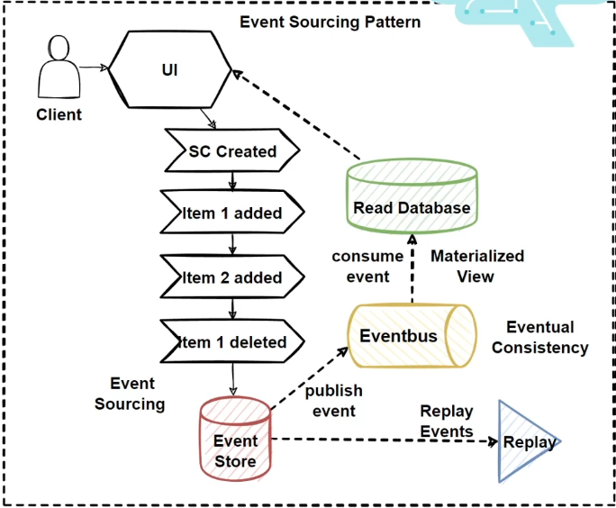

# Ordering Application Layer with CQRS and MediatR

## Overview

The Ordering application layer leverages Domain-Driven Design (DDD), CQRS (Command Query Responsibility Segregation), and Clean Architecture principles to build a structured, scalable, and testable application. The following components outline the responsibilities and structure of this layer.

### Key Features

- **Apply DDD, CQRS, and Clean Architecture Patterns**: Ensure a clear separation of concerns and maintainable code.
- **Develop Orders CRUD OrderCommand and Handler with CQRS**: Implement CQRS to handle commands (write operations) separately from queries (read operations).
- **Implement Command Process Pipeline**: Use MediatR to manage the command handling pipeline.
- **Develop IApplicationDbContext**: Provide an interface for dependency injection of EF Core DB context.
- **Develop MediatR Pipeline Behaviors (Validation, Logging)**: Apply cross-cutting concerns such as validation and logging within the MediatR pipeline.
- **Develop Domain Event Handlers with MediatR INotificationHandler**: Implement event-driven design with domain events using MediatR.
- **Develop Order Queries with CQRS and MediatR**: Structure queries separately from commands to follow the CQRS pattern.

### Main Target of Infrastructure Layer

The infrastructure layer's primary purpose is to implement application logic and use cases with CQRS and MediatR patterns.

---

## Fundamental Patterns of Application Layers

### Patterns

1. **CQRS Pattern**: Separates the write and read sides, ensuring each responsibility is handled by dedicated models and handlers.
2. **Event Sourcing Pattern**: Captures changes as events instead of storing the final state.
3. **CQRS with Event Sourcing Pattern**: Combines CQRS with event sourcing to store the entire history of changes.
4. **Eventual Consistency Principle**: Allows for consistency to be achieved over time rather than immediately.

### Steps to Implement

- **Design Ordering Microservice Application Layer and Web**: Create the structure for handling application logic in the Ordering microservice.
- **Implement Command and Command Handler Patterns with MediatR**: Utilize MediatR to manage command execution, decoupling it from command handling.

---

## Diagram and Example

The diagrams illustrate the event sourcing pattern and the flow of commands and queries in a CQRS pattern applied within the Ordering microservice architecture. 

1. **Event Sourcing Flow**:
   - The UI triggers events (e.g., an item added or removed).
   - These events are stored in an **Event Store** and published to an **Event Bus**.
   - A **Materialized View** is created by consuming events, supporting eventual consistency.