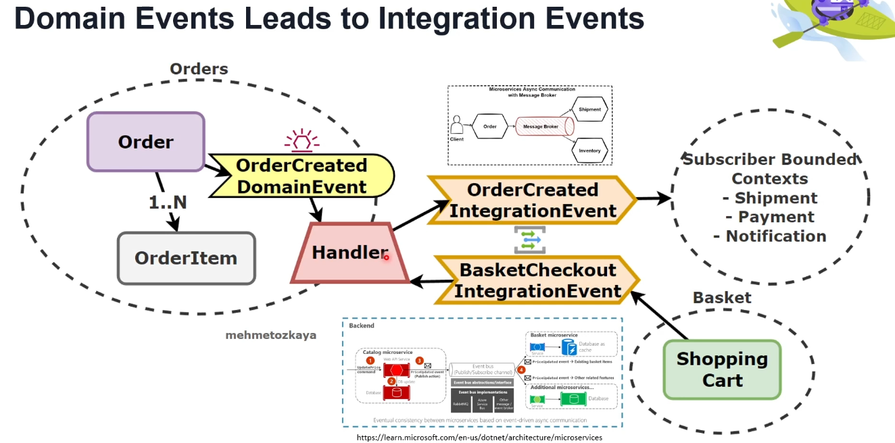

# Domain Events Leading to Integration Events

This document outlines how domain events trigger integration events, which are essential for communication between different bounded contexts within a microservices architecture.

## Overview

- **Domain Event**: A significant event within a specific domain that affects the state of an entity or aggregates.
- **Integration Event**: An event that crosses bounded contexts, often used to notify other microservices or systems of changes that may affect them.

### Flow

1. **Order Creation**:
   - When an `Order` is created, it contains multiple `OrderItem` entities (1..N relationship).
   - The `OrderCreated` domain event is triggered, signaling the creation of an order within the system.

2. **Event Handling**:
   - A dedicated **Handler** listens for the `OrderCreated` domain event.
   - The handler processes this event and converts it into integration events for external communication.

3. **Integration Events**:
   - **OrderCreated Integration Event**: Indicates that a new order has been created and is ready for further processing in other systems.
   - **BasketCheckout Integration Event**: Notifies that a checkout has been completed in the shopping cart.

4. **Subscriber Bounded Contexts**:
   - These integration events are consumed by other bounded contexts that subscribe to these events, such as:
     - **Shipment**: Handles the logistics of delivering the order.
     - **Payment**: Manages the payment processing for the order.
     - **Notification**: Sends notifications to the user about the order status.

### Visual Representation

- The image depicts the `Order` and `OrderItem` entities within the "Orders" bounded context.
- The `OrderCreated DomainEvent` is processed by a handler, which then produces the `OrderCreated IntegrationEvent` and `BasketCheckout IntegrationEvent`.
- These integration events are consumed by the "Basket" bounded context (Shopping Cart) and other subscriber contexts (Shipment, Payment, Notification).