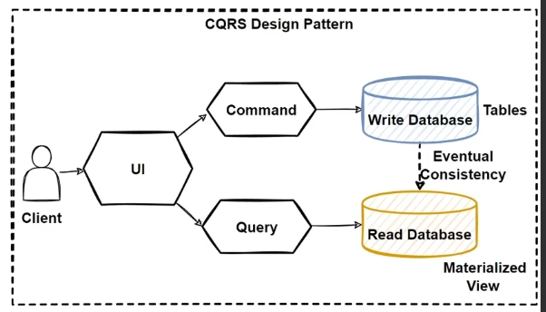

# CQRS and Application Layer in Ordering Service

## Ordering.Application Layer with CQRS and MediatR
- **Apply DDD, CQRS, and Clean Architecture Patterns**: Implementing Domain-Driven Design (DDD), CQRS, and Clean Architecture to achieve a modular and testable structure.
- **Develop Orders CRUD OrderCommand and Handler with CQRS**: Creating commands for Create, Read, Update, and Delete (CRUD) operations in a Command-Query Responsibility Segregation (CQRS) model.
- **Implement the Command Process Pipeline with MediatR**: Utilizing the MediatR library to manage the command processing pipeline, which helps in decoupling the logic.
- **Develop IApplicationDbContext for Dependency Injection of EF Core DB Context**: Facilitates injection of `ApplicationDbContext` using EF Core, improving the testability of the code.
- **Develop MediatR Pipeline Behaviors for Cross-cutting Concerns**: Implementing pipeline behaviors like validation and logging for better modularity and centralized handling of cross-cutting concerns.
- **Develop Domain Event Handlers with MediatR INotificationHandler**: Setting up handlers to process domain events, making the system reactive to changes within the domain.
- **Develop Order Queries with CQRS and MediatR**: Implementing read operations to fetch order data by segregating query concerns from command concerns.

### Main Target of Infrastructure Layer
- Implementing application logic and use cases using CQRS and MediatR patterns to ensure better separation of concerns and scalability.

## Fundamental Patterns of Application Layers
- **CQRS Pattern**: Separates read and write operations to improve performance and scalability.
- **Event Sourcing Pattern**: Persisting state changes as a series of events, which can later be replayed to reconstruct the state.
- **CQRS with Event Sourcing Pattern**: Combining CQRS and Event Sourcing to handle complex data operations more effectively.
- **Eventual Consistency Principle**: Ensures that, over time, the system will reach a consistent state.
  
### Steps After Implementing Patterns
1. **Design Ordering Microservice Application Layer and Web**: Crafting the web layer to interact with the application layer effectively.
2. **Implement Command and Command Handler Patterns with MediatR**: Utilizing MediatR for handling commands in the application layer, maintaining clean separation.

## CQRS - Command Query Responsibility Segregation
- **CQRS Design Pattern**: Avoids complex queries by eliminating inefficient joins.  
- **Separates Read and Write Operations**: Commands modify state; queries fetch data without altering it.
- **Commands**: Used to change the state of data within the application.
- **Queries**: Handle complex data retrieval tasks, typically involving joins and returning a result set.
- **Improves Scalability in Microservices**: Handles high-volume data requirements effectively in a microservices architecture.
- **Single Database Bottleneck**: Reduces bottlenecks by separating read and write databases.
- **CQRS with Event Sourcing**: Uses both CQRS and Event Sourcing to enhance application performance.
  
## CQRS – Read and Write Operations
- **Monolithic Database Limitation**: Single databases handling both complex queries and CRUD operations can be inefficient in complex applications.
- **Complex Applications**: As applications grow, the single database model becomes unmanageable.
- **High Query Latency**: Joins across many tables lock the database, leading to latency.
- **Separate Read and Write Databases**: Implements "Separation of Concerns" by using two databases.
  - **Read Database**: Uses NoSQL databases with denormalized data for fast reads.
  - **Write Database**: Relational databases that maintain data integrity.