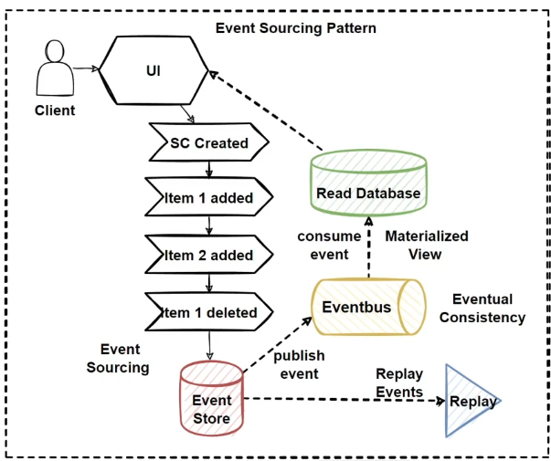

# CQRS and Event Sourcing in Domain-Driven Design

## CQRS - Command Query Responsibility Segregation

- **CQRS design pattern** is used to avoid complex queries, eliminating inefficient joins.
- Separates **read** and **write operations** by dividing them into separate databases.
- **Commands:** Responsible for changing the state of data in the application.
- **Queries:** Handle complex join operations, returning results without changing the application's data state.
- Suitable for **large-scale microservices architectures** that need to manage high-volume data requirements.
- A **single database** for services can cause bottlenecks.
- Uses both **CQRS and Event Sourcing** patterns to improve application performance.
- CQRS **separates read and write data** to optimize query performance and scalability.

---

## CQRS – Read and Write Operations

- **Monolithic architecture** with a single database handles both complex join queries and CRUD operations, which can become inefficient.
- As applications grow in complexity, query and CRUD operations may become unmanageable.
- Complex queries (e.g., joining more than 10 tables) can cause database locking due to high query latency.
- **CRUD operations** requiring complex validations and long business logic processing can also lead to database locking.
- Separating **reading and writing databases** introduces different strategies for handling data:
  - **Read database:** Uses NoSQL databases with denormalized data.
  - **Write database:** Uses relational databases with fully normalized data, ensuring strong data consistency.

---

## Event Sourcing Pattern

- Applications typically store data as the **current state** of the entity (e.g., updating the email in an address table to reflect the latest value).
- **Frequent updates** in large architectures can negatively impact performance, scalability, and responsiveness.
- The **Event Sourcing pattern** stores every change as an event in an Event Store database.
  - Instead of storing only the latest data, all events are saved in a **sequentially ordered event log**.
  - This events database is called the **Event Store**.

### Event Sourcing Pattern - 2

- Instead of **overwriting** data, each change is recorded as a new sequential event.
- The **Event Store database** becomes the source of truth.
- Sequential event lists can be used to generate **Materialized Views**, which represent the final state of data for queries.
- The **Event Store** is converted into a read database using the Materialized Views pattern.
- Convert operations can be handled by a **publish/subscribe** pattern, using message brokers.
- Event lists allow replaying events from any point in time, enabling rebuilding of data to a specific historical state.

---

## Domain Events in DDD

- **Domain Events** represent events that happened in the past and must be reacted to within the same service boundary in a domain model.
- A **Domain Event** signifies a business event within the domain model, often as a side effect of a domain operation.
- Domain Events ensure **consistency between aggregates** within the same domain.
- For example, an **OrderPlaced** event might be triggered when an order is placed.
- **Side effects** can be triggered or notifications sent to other parts of the system in response to changes.

### How to Use Domain Events in DDD?

- **Encapsulate** the event details and **dispatch** them to interested parties.

---

## Ordering.Application Layer with CQRS and MediatR

- **Apply DDD, CQRS, and Clean Architecture Patterns.**
- Develop **Order Commands and Handlers** with CQRS for CRUD operations.
- Implement the **command process pipeline** using the Mediator Pattern (MediatR).
- Develop an **IApplicationDbContext** to inject EFCore DB Context objects.
- Create **MediatR Pipeline Behaviors** (Validation, Logging) for cross-cutting concerns.
- Use MediatR **INotificationHandler** to develop Domain Event Handlers.
- Develop Order Queries using CQRS and MediatR.

### Main Target of the Infra Layer

- Implement application logic and use cases using **CQRS** and **MediatR** patterns.

---

## Fundamental Patterns of Application Layers

- **CQRS Pattern**
- **Event Sourcing Pattern**
- **CQRS with Event Sourcing Pattern**
- **Eventual Consistency Principle**

### After that:

- Design an **Ordering Microservice Application Layer** for the web.
- Implement Command and Command Handler patterns with **MediatR**.