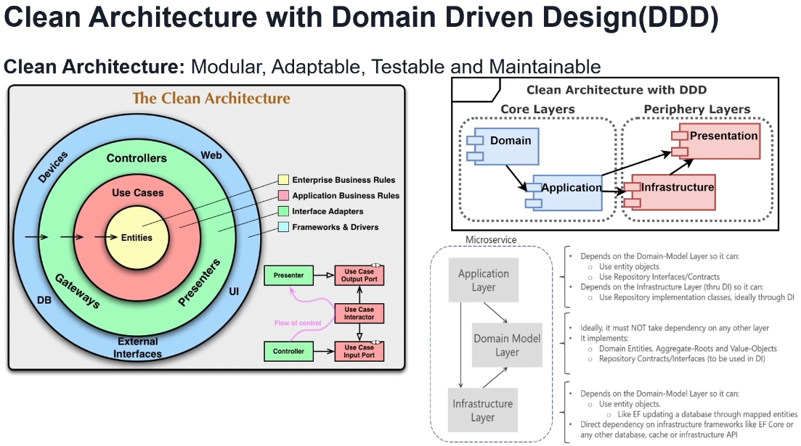
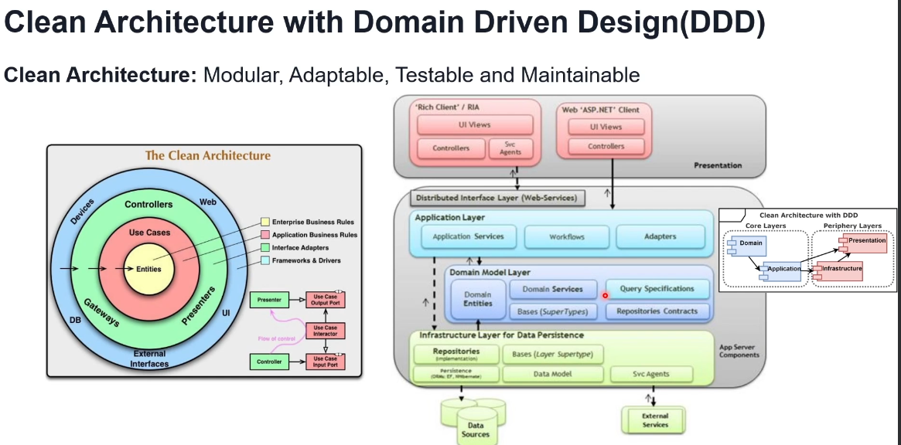

# Clean Architecture with Domain Driven Design (DDD)

Clean Architecture and Domain Driven Design (DDD) are combined to create a modular, adaptable, testable, and maintainable system structure. The focus is on separating concerns, organizing layers by responsibility, and ensuring clear dependency flow.

---

## Overview of Clean Architecture Layers

### Core Layers
- **Domain Layer**:
  - Represents the core business logic.
  - Contains entities, aggregate roots, and value objects which define the structure and behavior of business data.

- **Application Layer**:
  - Manages application-specific use cases.
  - Implements workflows and rules that drive the domain layer, often using services or use case interactors.
  - Only depends on the **Domain Layer**, following Dependency Inversion principles.

### Periphery Layers
- **Infrastructure Layer**:
  - Acts as the adapter for external concerns, such as databases or external APIs.
  - Responsible for providing implementations of repository interfaces, persistence, and caching.
  - Depends on **Domain Layer** for using entity objects and on **Application Layer** through Dependency Injection (DI) to interact with repositories.

- **Presentation Layer**:
  - Contains the user interface or API endpoints.
  - Communicates with the Application layer to drive the business use cases.
  - Does not contain business logic; rather, it serves as the entry point for user interactions.

---

## Dependency Flow and Interaction Between Layers

1. **Dependency Inversion Principle**:
   - Higher-level policies are defined in the **Core Layers** (Domain and Application).
   - Lower-level details are implemented in the **Periphery Layers** (Infrastructure and Presentation).

2. **Flow of Control**:
   - Controllers in the Presentation Layer receive input and call upon use cases in the Application Layer.
   - Use Cases interact with entities and services within the Domain Layer to fulfill business rules.
   - Outputs from use cases are sent back to the Presentation Layer via presenters, often formatted or adapted to the user interface requirements.

---

## Clean Architecture and DDD in Microservices

### Microservice Layer Interaction
- **Application Layer**:
  - Depends on the **Domain Model Layer** for use of entity objects and repository interfaces.
  - Implements the business use cases as independent units that are flexible to change.

- **Domain Model Layer**:
  - Must be free from dependencies on other layers.
  - Implements the domain entities, aggregates, and value objects required for business functionality.

- **Infrastructure Layer**:
  - Contains implementations of the repository and database access.
  - Interacts with the **Domain Model Layer** to provide persistence, caching, and other external interactions.

---

## Key Principles of Clean Architecture with DDD

1. **Modular Structure**:
   - Core business logic is isolated from frameworks and tools to support easy testing and maintenance.
  
2. **Adaptability**:
   - Each layer can be adapted independently without breaking the others.

3. **Testability**:
   - Since the business rules are separated from the UI, they can be tested in isolation.

4. **Maintainability**:
   - Changes in external systems (databases, UI) do not affect core business logic.