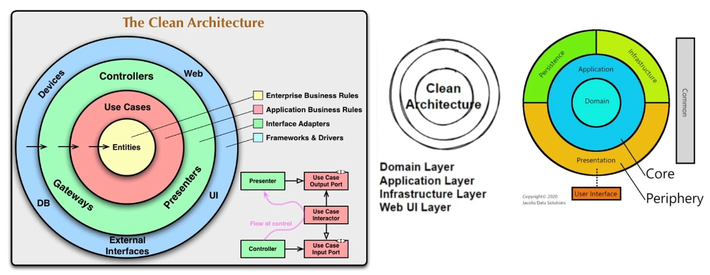

# Key Principles of Clean Architecture

Clean Architecture emphasizes creating adaptable, maintainable, and scalable software. The principles ensure the system is designed to handle future changes and remain robust over time. Below are the essential principles of Clean Architecture.

---

## Independence of Frameworks
- **Definition**: The system is not tightly coupled with a specific framework.
- **Explanation**: This principle makes the architecture adaptable to changes in frameworks and tools. It allows developers to replace frameworks without modifying core business logic, thus keeping the system flexible.

---

## Testable
- **Definition**: The business rules can be tested in isolation.
- **Explanation**: Clean Architecture allows testing business rules without relying on external elements such as the UI, databases, or web servers. This approach promotes higher code quality and reliable software functionality by enabling thorough testing of the core logic.

---

## UI Agnostic
- **Definition**: The user interface (UI) can change independently of the business logic.
- **Explanation**: This principle ensures that the UI layer can evolve separately. Developers can modify or replace the UI without impacting the underlying business rules, allowing for UI upgrades or redesigns with minimal disruption.

---

## Database Agnostic
- **Definition**: Business rules and logic are decoupled from the database.
- **Explanation**: Clean Architecture ensures that business rules are independent of any specific database or data storage. This decoupling makes it easier to switch or upgrade databases without impacting the core system.

---

## External System Agnostic
- **Definition**: Business rules operate independently of external systems.
- **Explanation**: Business logic does not rely on external systems or dependencies, promoting isolation. This isolation enhances maintainability and resilience, allowing the system to function even if external systems change or fail.

---

## Diagram Overview

- The diagrams illustrate the core-periphery structure in Clean Architecture.
- The **Core** consists of the **Domain** and **Application** layers, where essential business logic resides.
- The **Periphery** includes the **Infrastructure** and **Presentation** layers, which can change without impacting the core.
- This layered design supports independence, testability, UI flexibility, database neutrality, and isolation from external systems.
