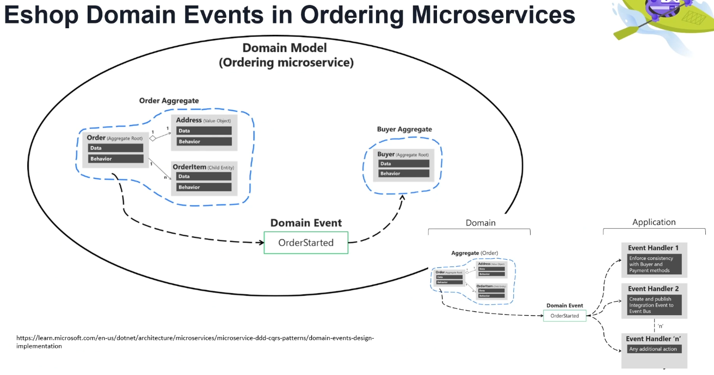

# Domain Event in Domain-Driven Design (DDD)

## What are Domain Events?
- **Domain Events** represent something that **happened in the past** and require other parts within the **same service boundary** (same domain) to react to these changes.
- A **Domain Event** is a **business event** that occurs within the domain model. It often represents a **side effect** of a domain operation.
- They help **achieve consistency** between **aggregates** in the same domain.
- For example, when an order is placed, an `OrderPlaced` event might be triggered.
- Domain Events **trigger side effects** or **notify other parts** of the system about changes within the domain.

## How to Use Domain Events in DDD?
1. **Encapsulate** the event details and **dispatch** them to interested parties.
2. **Communicate** changes within the domain to external handlers, which may perform actions based on these events.

## Benefits of Domain Events
- Promotes **decoupling** within the domain model by allowing different components to react to changes without being tightly integrated.
- Improves **scalability** as the application can react to domain changes asynchronously or in parallel.
- Enhances **maintainability** by centralizing the business logic within the domain, thus improving code readability and testing.

---

## Domain Events in eShop Ordering Microservices

### Domain Model Structure
The **eShop Ordering Microservices** model uses Domain Events to handle state changes and enforce consistency across aggregates.

1. **Order Aggregate**:
   - Contains entities such as `Order` (Aggregate Root), `Address` (Value Object), and `OrderItem` (Child Entity).
   - Manages order-related data and behavior within the ordering service boundary.

2. **Buyer Aggregate**:
   - Manages buyer-related data and behavior.
   - Ensures that buyer details are consistent with the order details.

### Example Domain Event: `OrderStarted`
- When a new order is initiated, an `OrderStarted` event is created to signify the beginning of an ordering process.
- The `OrderStarted` event is used to enforce consistency across the `Order` and `Buyer` aggregates.

### Event Handling in the Application Layer
1. **Event Handler 1**:
   - Ensures consistency by checking that buyer and payment methods are in sync with the order details.

2. **Event Handler 2**:
   - Publishes an integration event to the Event Bus, enabling other services to react to the `OrderStarted` event.

3. **Additional Event Handlers**:
   - Other handlers may be implemented to perform various actions as needed, such as logging, analytics, or triggering workflows.
