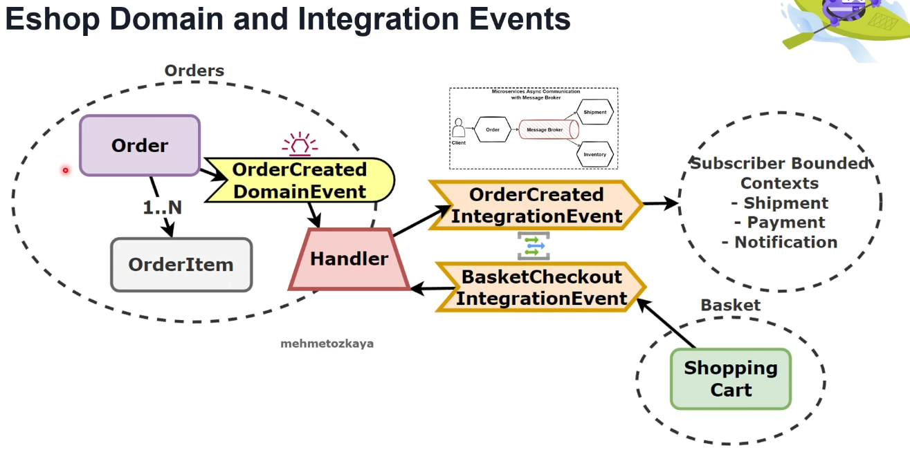

# Domain Events vs Integration Events

## Domain Events:
- **Definition**: Events that are published and consumed within a single domain. They are strictly bound to the microservice/domain context and do not extend beyond it.
- **Purpose**: Indicates something significant that has occurred within the aggregate in the domain model.
- **Characteristics**:
  - **In-process and synchronous**: Typically processed within the same domain, often sent using an in-memory message bus.
  - **Scope**: Only used within the boundaries of the microservice or domain context.
- **Example**: `OrderPlacedEvent`, which is triggered within the ordering service to indicate an order was placed.

## Integration Events:
- **Definition**: Events used to communicate state changes or other significant occurrences between different microservices or bounded contexts.
- **Purpose**: Provides a way for the overall system to react to specific domain events and synchronize states across multiple services.
- **Characteristics**:
  - **Asynchronous**: These events are usually sent via a message broker, enabling services to communicate across boundaries without being tightly coupled.
  - **Scope**: Designed to be consumed by different services in the broader system.
- **Example**: After handling an `OrderPlacedEvent`, an `OrderPlacedIntegrationEvent` might be published to a message broker (e.g., RabbitMQ), allowing other microservices to respond appropriately.

## Diagram Explanation:
The diagram illustrates the relationship between Domain Events and Integration Events within a bounded context:
1. **Aggregate**: Represents the root entity where the Domain Event is triggered.
2. **Domain Event**: Occurs within the bounded context (e.g., `OrderPlacedEvent` in the ordering domain).
3. **Handler**: Processes the Domain Event and may trigger an Integration Event as a result.
4. **Integration Event**: The event is published to communicate the occurrence of the Domain Event to other contexts or services.
5. **Subscriber Bounded Contexts**: Other services or contexts that subscribe to and react to the Integration Event.